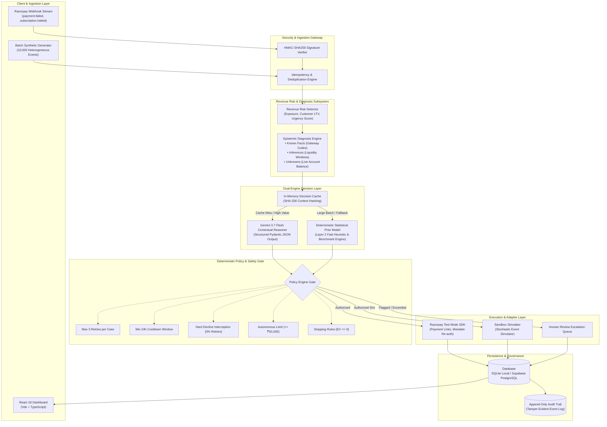
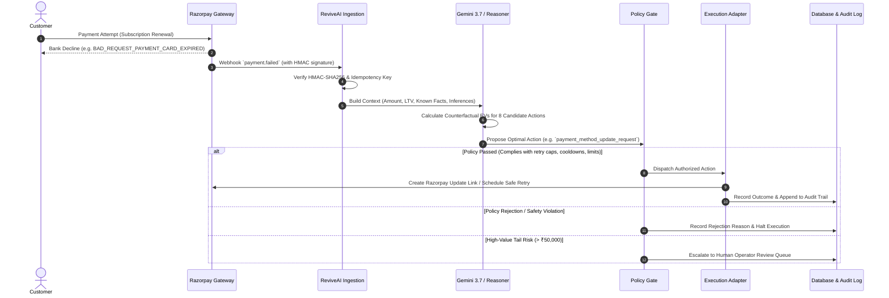

# ReviveAI

Autonomous revenue recovery and intelligent dunning engine built for Razorpay merchants.

When recurring subscriptions fail, card transactions decline, or UPI AutoPay mandates bounce, ReviveAI diagnoses the root cause, calculates net expected recovery values ($EV$) across multiple candidate interventions, enforces deterministic policy guardrails, and executes bounded recovery actions through Razorpay Test Mode or high-fidelity simulation.


```
LLM Proposes → Deterministic Policy Authorizes → Executor Executes
```

## System Architecture



## Recovery Lifecycle Flow



## Core Engineering Decisions

### 1. Separation of AI Proposals and Policy Authorization
Probabilistic models should not have unconstrained execution authority over financial transactions. ReviveAI enforces an architectural airgap: Gemini analyzes multidimensional context and proposes an action with counterfactual probabilities, but the deterministic Python policy engine holds sole authority to authorize, reject, or escalate the action.

### 2. Epistemic Separation of Facts, Inferences, and Unknowns
To prevent hallucinations regarding customer balances or bank conditions, input context is strictly categorized before passing to the reasoning engine:
* **Known Facts**: Verified cryptographic payload data (e.g., error code `BAD_REQUEST_PAYMENT_CARD_EXPIRED`, failure timestamps, consecutive attempts).
* **Inferences**: Statistical behavioral likelihoods (e.g., salary arrival between 1st–5th of the month, customer renewal history).
* **Unknowns**: Unobservable state (e.g., live bank account balance).

### 3. Net Expected Recovery Value ($EV$) Optimization
Candidate actions are scored by balancing gross recovery probability against operational intervention cost and customer relationship friction:

$$EV = P(\text{recovery} \mid \text{context}, \text{action}) \times \text{Amount} - \text{InterventionCost} - \text{FrictionPenalty}$$

* Low-friction delayed retries are prioritized for temporary banking timeouts.
* WhatsApp and email reminders are deployed when customer action is required (e.g., updating expired cards or re-authorizing UPI mandates).
* Hard declines (stolen cards, closed accounts) trigger zero retries, saving gateway fees and protecting merchant reputation.

### 4. Dual-Engine Scaling Architecture
Running 10,000 cases through a commercial LLM API introduces latency bottlenecks, rate limit exhaustion, and high token costs. ReviveAI addresses this with a tiered execution model:
* **Layer 1 (Safety Guards)**: Deterministic policy checks.
* **Layer 2 (Statistical Prior Engine)**: High-throughput local evaluation engine running 10,000 benchmark cases in under 1 second.
* **Layer 3 (Gemini 3.7 Flash)**: Deep contextual reasoning for complex, high-value, or ambiguous failure events with in-memory SHA-256 decision caching.

## Benchmark Evaluation Results (10,000 Payment Events)

To evaluate recovery performance under realistic conditions, ReviveAI was tested against a standard baseline (fixed 24-hour naive retry) on an identical test split of 10,000 heterogeneous payment failure events.

```bash
python evaluation/run_evaluation.py --samples 10000
```

| Metric | Baseline (Fixed Naive Retry) | ReviveAI (Adaptive Agent) | Net Difference / Lift |
| :--- | :--- | :--- | :--- |
| **Evaluated Events** | 10,000 | 10,000 | Identical Test Split |
| **Total Revenue at Risk** | ₹89,646,925.57 | ₹89,646,925.57 | Baseline parity |
| **Recovered Events** | 4,107 | **6,722** | **+2,615 (+63.7%)** |
| **Recovery Rate (%)** | 41.07% | **67.22%** | **+26.15% Absolute Lift** |
| **Total Recovered Revenue** | ₹37,439,603.18 | **₹61,399,308.00** | **+₹23,959,704.82 (+64.0%)** |
| **Direct Intervention Cost** | ₹91,990.00 | **₹26,990.00** | **-₹65,000.00 (Saved)** |
| **Customer Friction Penalty** | ₹221,980.00 | **₹262,265.00** | Balanced trade-off |
| **Net Economic Benefit Lift** | ₹0.00 | **+₹23,984,419.82** | **+₹23.98M Net Uplift** |
| **Avg Attempts per Case** | 1.84 | **1.00** | **-0.84 (Reduced friction)** |
| **Hard Declines Intercepted** | 0 (Wasted retries) | **100% Intercepted (19 cases)** | **Zero gateway penalty** |
| **Human Review Escalations** | 0 (Unchecked) | **272 high-value cases** | **Safety bounded** |

### Breakdown by Failure Scenario

| Scenario | Baseline Rate | ReviveAI Rate | Recovered Revenue (₹) | Absolute Lift |
| :--- | :--- | :--- | :--- | :--- |
| `expired_payment_method` | 0.0% | 63.3% | ₹10,805,066.19 | **+63.3%** |
| `upi_mandate_failed` | 33.6% | 66.4% | ₹6,896,694.09 | **+32.8%** |
| `auth_abandonment` | 35.5% | 62.7% | ₹2,300,811.86 | **+27.2%** |
| `bank_decline_hard` | 0.0% | 29.6% | ₹2,631,720.07 | **+29.6%** |
| `insufficient_funds` | 60.2% | 70.9% | ₹20,351,110.69 | **+10.7%** |
| `bank_decline_temporary` | 77.4% | 86.4% | ₹18,413,905.10 | **+9.0%** |

## Razorpay Integration & Safety Controls

* **Test Mode Enforcement**: Integrates with official Razorpay Test Mode APIs (`rzp_test_...`) for creating test payment links, customer notifications, and sandbox subscription handling.
* **Safety Lockout**: The backend validates credentials on startup and refuses to launch if live keys (`rzp_live_...`) are configured.
* **Webhook Signature Verification**: Incoming webhook payloads are validated using constant-time HMAC-SHA256 comparisons before processing.

## Tech Stack

* **Backend**: Python 3.13, FastAPI, SQLAlchemy 2.0 (Async), Pydantic v2, aiosqlite, asyncpg
* **AI & Reasoning**: Google Gemini 3.7 Flash (`google-genai`), Pydantic Structured JSON schema validation, Decision Caching
* **Payment Integration**: Razorpay Python SDK, HMAC-SHA256 Webhook Ingestion
* **Database**: SQLite (Zero-config local) / PostgreSQL (Supabase ready with migrations)
* **Frontend**: React 18, Vite, TypeScript, Lucide Icons, Vanilla CSS
* **Testing & Evaluation**: Pytest, Pytest-Asyncio, HTTPX

## Quickstart Guide

### 1. Clone & Configure
```bash
git clone https://github.com/nirnayyy/reviveai.git
cd reviveai
copy .env.example .env
```

### 2. Run Backend Server
```bash
python -m venv .venv
.venv\Scripts\activate  # On Linux/macOS: source .venv/bin/activate
pip install -r backend/requirements.txt
uvicorn backend.app.main:app --port 8000 --reload
```
Interactive OpenAPI documentation is available at `http://127.0.0.1:8000/docs`.

### 3. Run Frontend Operations Dashboard
```bash
cd frontend
npm install
npm run dev
```
Dashboard is accessible at `http://127.0.0.1:5173/`.

### 4. Run Test Suite
```bash
pytest
```

## Repository Structure

```
reviveai/
├── backend/
│   ├── app/
│   │   ├── api/             # FastAPI REST endpoints (cases, webhooks, simulation, audit)
│   │   ├── models/          # SQLAlchemy async ORM entities
│   │   ├── schemas/         # Pydantic schemas (AI decisions, events, policies)
│   │   ├── services/        # AI agent, diagnosis, value model, policy engine, execution adapter
│   │   ├── config.py        # Central configuration & test mode validation
│   │   ├── database.py      # Async database connection & session maker
│   │   └── main.py          # FastAPI application entrypoint & middleware
│   ├── migrations/          # PostgreSQL / Supabase schema (001) & seed data (002)
│   └── requirements.txt     # Python dependencies
├── evaluation/
│   ├── synthetic_generator.py # 10k heterogeneous dataset generator
│   ├── baseline_engine.py     # Naive retry baseline comparator
│   ├── run_evaluation.py      # Benchmark runner & metric calculator
│   └── evaluation_results.json # Verified benchmark output
├── frontend/
│   ├── src/
│   │   ├── components/      # Metrics, RecoveryQueue, CaseDetailModal, SimulationRunner
│   │   ├── services/api.ts  # Typed API client
│   │   ├── types/index.ts   # TypeScript interfaces
│   │   └── index.css        # Razorpay design tokens & glassmorphic theme
│   └── package.json
├── tests/                   # 12 automated unit, integration, and E2E test suites
├── FINAL_SUBMISSION_AND_EVALUATION_REPORT.md
├── pytest.ini
└── README.md
```

## License

Apache 2.0 License. Built for the Razorpay AI Revenue Recovery Buildathon.
